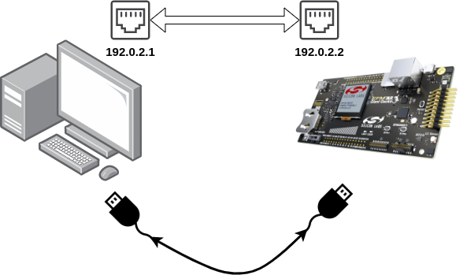

# KEMTLS and PQTLS in WolfSSL Experiments Code
This is the code accompanying the paper `KEMTLS vs. PQTLS: Performance on Embedded Systems`.
The experiments where designed to be fully reproducible.

This repository glues together all the pieces needed to run the code.
For this purpose it makes heavy use of submodules.
To clone it you therefore have to use `--recurse-submodules`:

```bash
git clone --recurse-submodules https://github.com/rugo/wolfssl-kemtls-experiments
```

## Components
This repository contains:

* Scripts for running the experiments and analyzing them
* Submodule `OQS/oqs-demos` to generate PQTLS certificates using liboqs' command line tool
* Submodule `kemtls-server-reproducible` wrapper repository around the [kemtls reference implementation](https://github.com/thomwiggers/kemtls-experiment). Used to generate KEMTLS certificates and build the KEMTLS server.
* Submodule `zephyr-docker` dockerized build container for [Zephyr RTOS](https://www.zephyrproject.org/), which is the OS used on the board. Includes scripts for building the actual Zephyr projects with KEMTLS and PQTLS.

Other components of the project, that are only indirectly included are:

* [Zephyr Project Including KEMTLS](https://git.fslab.de/rgonza2s/zephyr-project.git), pulled by Zephyr's `west` build tool
    * [WolfSSL with KEMTLS including PQM4 finalists](https://git.fslab.de/rgonza2s/wolfssl-kemtls-updated/-/tree/kemtls-nopqm4), pulled by Zephyr project
* [Zephyr Project Including PQTLS](https://git.fslab.de/rgonza2s/zephyr-project.git), pulled by Zephyr's `west` build tool
    * [WolfSSL with PQTLS including PQM4 finalists](https://git.fslab.de/rgonza2s/wolfssl-pqm4/-/tree/pqm4), pulled by Zephyr project
* [Namespaced PQM4](https://git.fslab.de/rgonza2s/namespaced-pqm4/-/tree/namespaced), PQM4 fork that includes namespacing for the finalists. Fixes some alignment issues and has `verify` functions for the finalists. This is a submodule of the WolfSSL libraries.

## Reproducing Results
### Hardware Setup
Our experiments where conducted on a [STK3701a Giant Gecko Board](https://www.silabs.com/development-tools/mcu/32-bit/efm32gg11-starter-kit).
This board needs to be connected to a host computer running the benchmarks/experiments.
The board needs to be connected via Ethernet (for networking) and via its JLink USB connector (for flashing and resetting).
Everything else, like the embedded tool chain should be included in the Docker container.



### Required Software
The software setup was tested on Arch Linux.
The scripts make heavy use of Docker and docker-compose to achieve reproducible builds.
To flash the binaries onto the board, the `Jlink` tools are required.
Specifically, the `JLinkExe` binary has to be in the PATH.
For the PQTLS benchmarks, also the `cmake` and an up-to-date `gcc` have to be available.

### Running the Experiments
To run the experiments, the ethernet adapter connected to the giant gecko needs to be set to the static IP address `192.0.2.1`.
Then, the `IFACE_NAME` variable in the `run_experiments.sh` (see blow) scripts have to be set to the network interface connected to the giant gecko (e.g. `IFACE_NAME=eth0`).

Four main scripts are needed to run the experiment:

* `scripts/generate_certificates.sh`, generates 1000 KEMTLS certificates per available PQC algorithm. This will run for a couple of hours.
* `scripts/pqtls/generate_certificates.sh`, generates 1000 PQTLS certificates per available PQC algorithm. This is slightly faster but will also run for an hour.
* `scripts/run_experiments.sh`, runs the KEMTLS experiments. This will run for a week.
* `scripts/pqtls/run_experiments.sh`, runs the PQTLS experiments. This will run for multiple days.

To run the full experiments, aka to generate all certificates then run KEMTLS and PQTLS in all possible PQC combinations with 1000 different certificates, you can just call:

```bash
./scripts/prepare_and_run_experiments.sh
```

The resulting benchmarks are stored in the `benchmarks` folder.

### Running Experiments with fewer iterations
In case you don't have the time to wait for so many results, you can reduce the number of iterations.

To do so in KEMTLS, do:

* Change `NUM_CERTS` variable in `kemtls-server-reproducible/scripts/gen_key.sh` to number of certificates desired per PQC algorithm combination.
* Change `NUM_ITERS` variable in `scripts/run_experiments.sh` to number of iterations per PQC algorithm combination.

To do so in PQTLS, do:

* Change `NUM_CERTS` variable in `OQS/scripts/gen_certs.sh` to number of certificates desired per PQC algorithm combination.
* Change `NUM_ITERS` variable in `scripts/pqtls/run_experiments.sh` to number of iterations per PQC algorithm combination.

### Collect results
To collect the benchmark results and save them in one directory, do:

```bash
./scripts/merge_benchmarks.py benchmarks/pqlts /tmp/pqtls
./scripts/merge_benchmarks.py benchmarks/kemtls /tmp/kemtls
```

You can now print the result tables of the paper with:

```bash
./scripts/print_tables.py /tmp/kemtls --paper
./scripts/print_tables.py /tmp/pqtls --paper --pqtls
```

If you want to print all collected bencharks, you can do that with:
```bash
./scripts/print_tables.py /tmp/kemtls --all
./scripts/print_tables.py /tmp/pqtls --pqtls --all
```

If you want to export the results to a csv file, you can do a:

```bash
./scripts/print_tables.py /tmp/kemtls --all --csv
./scripts/print_tables.py /tmp/pqtls --pqtls --all --csv 
```
